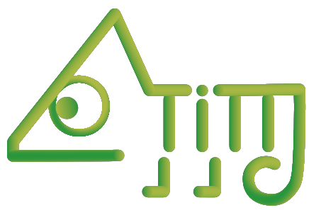
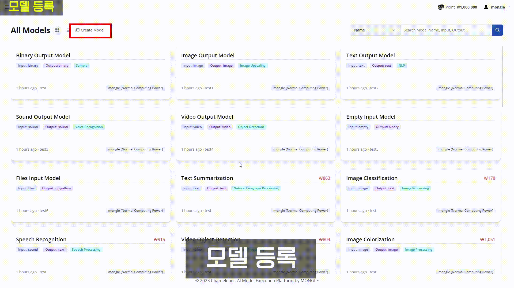
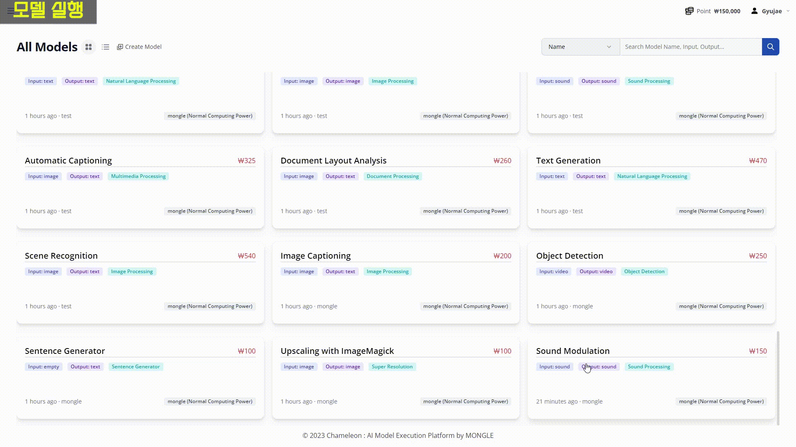
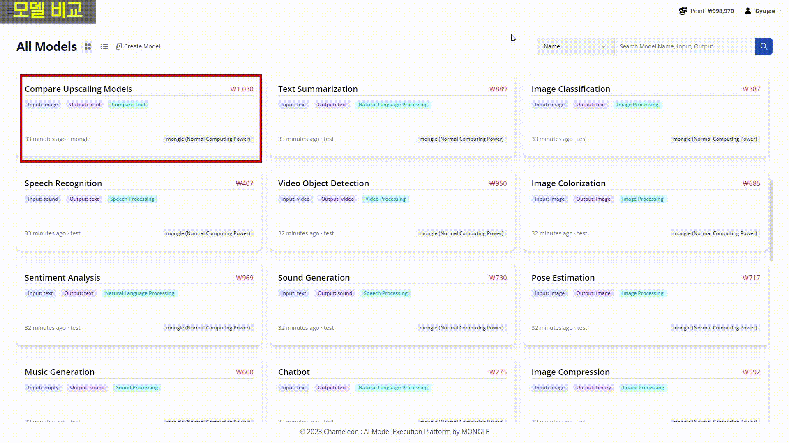

# Chameleon-Platform
> Controller for Chameleon

It's an execution platform that simplifies the testing and deployment of AI models.

It supports the ability to compare the execution results of multiple AI models, and provides a marketplace system selling virtual goods for developers and users to access and utilize various AI models.

|Create Model|
|---|
||

|Execute Model|
|---|
|| 

|Compare Model|
|---|
||
